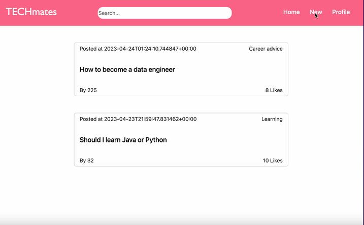

# *CSConnect*

This web app **is a site for CS students - create posts, leave comments, upvote posts, search posts and sort posts empowering CS commnity to discuss learning resources, technical questions and interview tips**

Technologies: React, React-router, Supabase, Figma

## Video Walkthrough

Here's a walkthrough of implemented required features:

<!-- Replace this with whatever GIF tool you used! -->
GIF created with Kap  
<!-- Recommended tools:
[Kap](https://getkap.co/) for macOS
[ScreenToGif](https://www.screentogif.com/) for Windows
[peek](https://github.com/phw/peek) for Linux. -->

<!-- - [ ] Users can only edit and deleted posts or delete comments by entering the secret key, which is set by the user during post creation
- [ ] Upon launching the web app, the user is assigned a random user ID. It will be associated with all posts and comments that they make and displayed on them.
- [ ] Users can repost a previous post by referencing its post ID. On the post page of the new post, the referenced post is displayed and linked, creating a thread
- [ ] Users can customize the interface of the web app
- [ ] Users can share and view web videos
- [ ] Users can set flags while creating a post. Then users can filter posts by flags on the home feed.
- [ ] Users can upload images directly from their local machine as an image file
- [ ] Display a loading animation whenever data is being fetched -->
